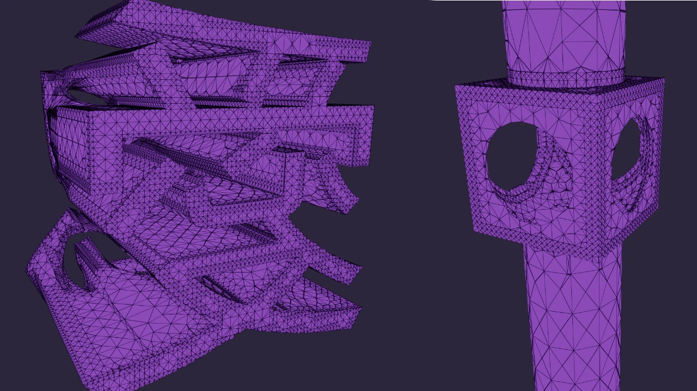

# Cubical Marching Squares



## Description

This repo implements the Cubical Marching Squares (CMS) algorithm for extracting a triangle mesh from hermite data.  
The implementation is based on the paper [Cubical Marching Squares: Adaptive Feature Preserving Surface Extraction from Volume Data](https://www.csie.ntu.edu.tw/~cyy/publications/papers/Ho2005CMS.pdf).  
The implementation is in C# (not Unity) and uses .NET 8.0.  
The implementation tries to implement the complete algorithm, but there are probably some edge cases and bugs that are not handled correctly. It's mostly intended for educational purposes.

## Usage

```csharp
using Aviz.Cms;
using V3 = System.Numerics.Vector3;
using V2 = System.Numerics.Vector2;

// SDF functions ported from
// https://iquilezles.org/articles/distfunctions/
static float sdBox(V3 p, V3 b )
{
    var q = V3.Abs(p) - b;
    var t1 = V3.Max(q, new V3(0.0f));
    return t1.Length() + MathF.Min(MathF.Max(q.X, MathF.Max(q.Y, q.Z)), 0.0f);
}

static float sdSphere(V3 p, float r)
{
    return p.Length() - r;
}

static float sdCylinder(V3 p, float h, float r )
{
    V2 d = new V2(new V2(p.X, p.Z).Length(), float.Abs(p.Y)) - new V2(r, h);
    return float.Min(float.Max(d.X, d.Y), 0.0f) + new V2(float.Max(d.X, 0.0f), float.Max(d.Y, 0.0f)).Length();
}

static float opUnion(float d1, float d2) {
    return MathF.Min(d1, d2);
}

static float opSubtract(float d1, float d2) {
    return MathF.Max(-d1, d2);
}

static float sdFunc(V3 pos) {
    var center = new V3(16.0f, 14.5f, 16.0f);
    var sphere = sdSphere(pos - center, 3.55f);
    var box = sdBox(pos - center, new V3(3.0f, 3.0f, 3.0f));
    var cylinder = sdCylinder((V3)pos - center, 15.0f, 2.3f);
    return opSubtract(sphere, opUnion(box, cylinder));
}

V3 sdNormal(V3 p) {
    var e = 0.001f;
    return V3.Normalize(new V3(
        sdFunc(p + new V3(e, 0, 0)) - sdFunc(p - new V3(e, 0, 0)),
        sdFunc(p + new V3(0, e, 0)) - sdFunc(p - new V3(0, e, 0)),
        sdFunc(p + new V3(0, 0, e)) - sdFunc(p - new V3(0, 0, e))
    ));
};

HermiteData data = HermiteData.FromSdf(sdFunc, sdNormal, new V3(0.0f), 0.25f, 128);
var (vertices, indices) = CellTree.ExtractSurface(data, initialSubdivisions: 3);
Console.WriteLine($"Generated mesh with {vertices.Length} vertices and {indices.Length / 3} triangles.");
```

### TODO

- [ ] Better handling of cases where 'sharp feature' is outside the cell (currently these are discarded). Probably the best possible option is to intersect SVD null space with the cell boundary and find the minimum norm point on that intersection.
- [ ] Output normals. The only real issue is what to do with the new vertices created for sharp features. The vertices most likely need to be duplicated to have a sharp edge.
- [ ] Testing and fixing edge cases and bugs.
